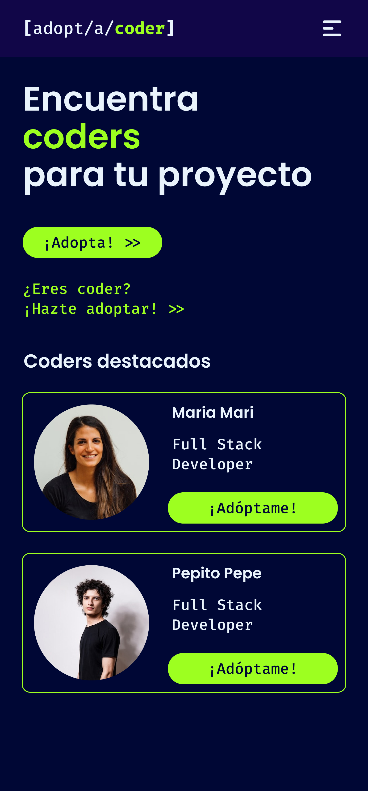
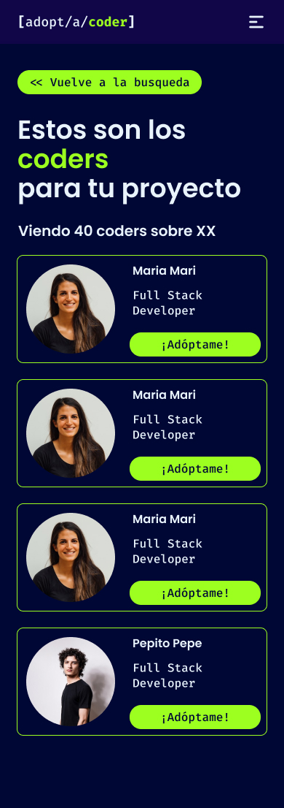
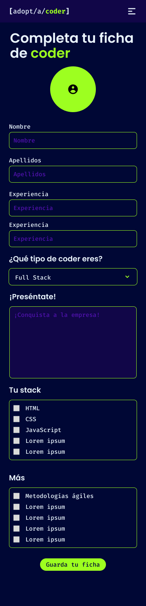
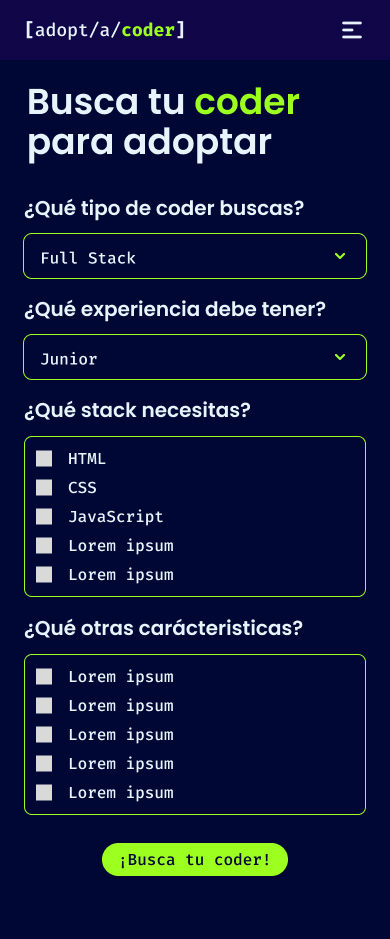
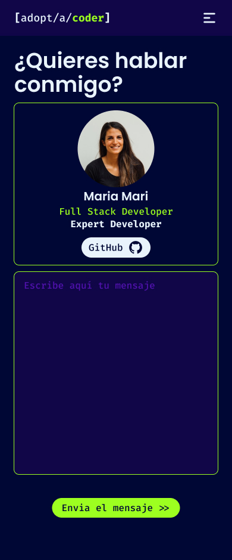
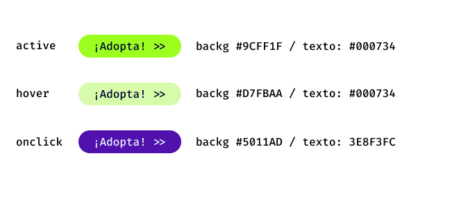

# [adopt/a/coder]
***

This project was created to connect coders with enterprises which want to take care of them, since both of them are looking for concret and special skills, and there is not time to lose.

## :iphone: Mobile Graphic reference

### [adopt/a/coder]'s logo

###Page views:

### Button colors

## Tech/framework used :electric_plug
* **HTML** - used to create the website's basic structure
* **CSS** - used to style the user interface
* **React**- used for web page development

## Technology stack :gear:
* **Bootstrap 5.2.3** - used to ease the web development process of responsive, mobile-first [Official website](https://getbootstrap.com/)
* **npm** - used to manage dependencies
* **jest** - used for testing
* **iconify** - used to 

## Installation :mechanic:
* Create a directory on your computer to store the project
* Run ***$ git clone https://github.com/adoptacoder-app/adoptacoder.git*** 

## `npm install` 
* First, in te project directory, run ***$ npm install***

## `npm start`
* Then, in the project directory, run ***$ npm start***
* The page will reload when you make changes.\
You may also see any lint errors in the console.

### `npm test`
It runs the app in the development mode.
* Open [http://localhost:3000](http://localhost:3000) to view it in your browser.
Launches the test runner in the interactive watch mode.
* See the section about [running tests](https://facebook.github.io/create-react-app/docs/running-tests) for more information.

### `More information about React`
You can know more details by checking the [Create React App documentation](https://facebook.github.io/create-react-app/docs/getting-started).

## API Reference 👩‍💻
Click [here](https://63f6400d59c944921f706c26.mockapi.io/api/user) 

## Contributors :family_woman_woman_girl_girl: 
* [Rosemary Rengel](https://github.com/rrengelj)Scrum Master and Developer
* [Iris Leo](https://github.com/mauisiri) Product Owner and Developer
* [Said García](https://github.com/SaidGM) Developer
* [Ava Hocsem](https://github.com/hocsem) Developer
* [Galit Bixio](https://github.com/gbixio) Developer
* [Tania Díaz](https://github.com/TaniaPandal) Developer
* [Jéssica Ríos](https://github.com/JessRm04) Developer
* [Camilo Rocca](https://github.com/camilorocca) Developer
* [Gabriela Fernández](https://github.com/gabyfdez90) Developer

## License :closed_lock_with_key:
[adopt/a/coder](https://github.com/adoptacoder-app) ©

